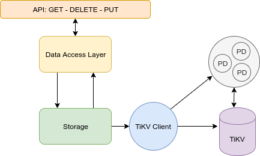

# Xây dựng Key-Value Store

Trong kiến trúc của ZPD, package TiKVClient còn đóng luôn vai trò giao tiếp với PD để lấy metadata và gọi TiKV, nói chung ở tầng storage này ta sử dụng TiKVClient như là một SDK để có thể sử dụng tất cả các API của TiKV.

<div align="center">
  
</div>

Bài viết này sẽ đưa ra một ví dụ sử dụng package TiKVClient và các image PD, TiKV của pingcap để hiện thực một Key-Value store đơn giản.

## Storage Layer

Ta tạo package storage và xem đây là storage layer. Dùng 2 package sau:

```go
import (
    "github.com/tikv/client-go/config"
    "github.com/tikv/client-go/rawkv"
)
```

Interface Storage chứa các phương thức làm việc với TiKV

```go
type Storage interface {
    ConnectTiKV(ctx context.Context) error
    DisConnectTiKV() error
    GetClient() interface{}
}
```

Một struct RawTiKV dùng để implement interface này:

```go
type RawTiKV struct {
    // mảng các địa chỉ tới PD
    host []string
    client *rawkv.Client
}
```

Bây giờ ta sẽ hiện thực phương thức ConnectTiKV để kết nối tới rawkv

```go
func (rawtikv *RawTiKV) ConnectTiKV(ctx context.Context) error {
    cli, err := rawkv.NewClient(ctx, rawtikv.host, config.Default())
    if err != nil {
        return err
    }

    rawtikv.client = cli
    return nil
}
```

Lúc này ta đã có một Storage Layer chứa bên trong là các logic của PD và TiKV, giờ chỉ cần một Layer nữa làm trung gian với các Application phía cao hơn.

## Data Access Layer

Ta dùng một interface để wrap 3 api cơ bản nhất do TiKV cung cấp (đây là tầng Data Access Layer)

```go
type DAO interface {
    Get(ctx context.Context, key []byte) ([]byte, error)
    Put(ctx context.Context, key []byte, value []byte) error
    Delete(ctx context.Context, key []byte) error
}
```

Sau đó dùng một struct để implement các api trên:

```go
type Impl struct {
    rawKV storage.Storage
}
```

Sau đó chỉ cần wrap các lời gọi ở lớp storage thành api là được:

```go
func (dao Impl) Get(ctx context.Context, key []byte) ([]byte, error) {
    cli := dao.rawKV.GetClient().(*rawkv.Client)

    return cli.Get(ctx, key)
}
func (dao Impl) Put(ctx context.Context, key []byte, value []byte) error {
    cli := dao.rawKV.GetClient().(*rawkv.Client)

    return cli.Put(ctx, key, value)
}
func (dao Impl) Delete(ctx context.Context, key []byte) error {
    cli := dao.rawKV.GetClient().(*rawkv.Client)
    return cli.Delete(ctx, key)
}
```

Dứng trên các layer cao hơn ta có thể sử dụng Data Access Layer này để gọi xuống các API của TiKV (Storage layer), việc này giúp cho code của chúng ta độc lập và dễ mở rộng hơn.

## Deploy Key-Value store

Ta sử dụng image PD và TiKV có sẵn của pingcap ([tidb-docker-compose](https://github.com/pingcap/tidb-docker-compose)), và deploy thành hệ thống gồm:

- 3 PD
- 3 TiKV
- 1 node là server của ta xây dựng

File docker-compose (xem file đầy đủ tại [docker-compose.yml](https://github.com/quocanh1897/TiKV-KVStore/blob/master/docker-compose/docker-compose.yml)):

```yml
services:
  pd0:
    image: pingcap/pd:latest
    ports:
      - "2379"
    volumes:
      - ./config/pd.toml:/pd.toml:ro
      - ./data:/data
      - ./logs:/logs
    command:
      - --name=pd0
      - --client-urls=http://0.0.0.0:2379
      - --peer-urls=http://0.0.0.0:2380
      - --advertise-client-urls=http://pd0:2379
      - --advertise-peer-urls=http://pd0:2380
      - --initial-cluster=pd0=http://pd0:2380,pd1=http://pd1:2380,pd2=http://pd2:2380
      - --data-dir=/data/pd0
      - --config=/pd.toml
      - --log-file=/logs/pd0.log
    restart: on-failure
# pd1 và pd2 tương tự
......
  tikv0:
    image: pingcap/tikv:latest
    volumes:
      - ./config/tikv.toml:/tikv.toml:ro
      - ./data:/data
      - ./logs:/logs
    command:
      - --addr=0.0.0.0:20160
      - --advertise-addr=tikv0:20160
      - --data-dir=/data/tikv0
      - --pd=pd0:2379,pd1:2379,pd2:2379
      - --config=/tikv.toml
      - --log-file=/logs/tikv0.log
    depends_on:
      - "pd0"
      - "pd1"
      - "pd2"
    restart: on-failure
# tikv1 và tikv2 tương tự
......
  ticlient:
    image: ticlient:latest
    depends_on:
      - "pd0"
      - "pd1"
      - "pd2"
    volumes:
      - ../:/ticlientcode
    ports:
      - "10001:10001"
    restart: on-failure
```

Địa chỉ của các node pd (pd0, pd1, pd2) ta có thề truyền vào hàm bằng biến config (để tiện cho việc mở rộng sau này) như sau:

```go
type Config struct {
    PDConfig []string
}

func GetConfig() *Config {
    return &Config{
        PDConfig: []string{"pd0:2379","pd1:2379","pd2:2379"},
    }
}
```

Ta test các api xây dựng ở trên bằng các hàm test như sau:

```go
func testSetKeyValue(ctx context.Context) {
    logrus.Info("=========[TEST SET KV]=========")
    cfg := GetConfig()
    dal, er := dal.NewDAO(ctx, cfg)
    if er != nil {
        logrus.Error("[TEST DAO FAIL]: ", er.Error())
    }

    key := []byte("test-key")
    val := []byte("val-corr")

    err := dal.Put(ctx, key, val)
    if err != nil {
        logrus.Fatal("[TEST SET KV]: ", err.Error())
    }

    err = dal.DisconnectStorage()
    if err != nil {
        logrus.Fatal("[TEST SET KV]: ", err.Error())
    }
}

func testGetKeyExist(ctx context.Context){
    logrus.Info("=========[TEST GET KV EXIST]=========")

    cfg := GetConfig()
    dal, er := dal.NewDAO(ctx, cfg)
    if er != nil {
        logrus.Error("[TEST DAO FAIL]: ", er.Error())
    }

    key := []byte("test-key")
    val := []byte("val-corr")

    err := dal.Put(ctx,key,val)
    if err != nil {
        logrus.Fatal("[TEST GET KEY EXIST]: ", err.Error())
    }

    val, err = dal.Get(ctx, key)
    if err != nil {
        logrus.Fatalf("[testGetKeyExist]" + err.Error())
    }

    logrus.Infof("[TEST GET KEY EXIST] key: %s for val: %s", key, val)

    err = dal.DisconnectStorage()
    if err != nil {
        logrus.Fatalf("[TEST GET KEY EXIST]" + err.Error())
    }
}

func testDelKey(ctx context.Context){
    logrus.Info("=========[TEST DELETE KV]=========")

    key := []byte("test-del-key")
    val := []byte("val-of-test-del-key")
    cfg := GetConfig()
    dal, er := dal.NewDAO(ctx, cfg)
    if er != nil {
        logrus.Error("[TEST DAO FAIL]: ", er.Error())
    }

    //put
    err := dal.Put(ctx, key, val)
    if err != nil {
        logrus.Fatalf("[TEST DEL KEY]" + err.Error())
    }

    //get
    val, err = dal.Get(ctx, key)
    if err != nil {
        logrus.Fatalf("[TEST DEL KEY]" + err.Error())
    }

    logrus.Infof("[TEST DEL KEY] before del key: %s & val: %s", key, val)

    //delete
    err = dal.Delete(ctx, key)
    if err != nil {
        logrus.Fatalf("[TEST DEL KEY]" + err.Error())
    }

    //get
    val, err = dal.Get(ctx, key)
    if err != nil {
        logrus.Fatalf("[TEST DEL KEY]" + err.Error())
    }

    logrus.Infof("[TEST DEL KEY] after del key: %s & val: %s", key, val)

    err = dal.DisconnectStorage()
    if err != nil {
        logrus.Fatalf("[TEST DEL KEY]" + err.Error())
    }
}
```

Thực thi ta được kết quả:

```log
INFO[0000] =========[TEST SET KV]=========
INFO[0000] [Storage] connecting with TiKV ... [pd0:2379 pd1:2379 pd2:2379]
INFO[0000] [pd] create pd client with endpoints [pd0:2379 pd1:2379 pd2:2379]
INFO[0000] [pd] leader switches to: http://pd1:2379, previous:  
INFO[0000] [pd] init cluster id 6745750062202875541
INFO[0000] [Storage] connected with TiKV [pd0:2379 pd1:2379 pd2:2379]
INFO[0000] [TEST SET KV] ok!
INFO[0000] [Storage] DisConnected with success
INFO[0000] =========[TEST GET KV EXIST]=========
...
INFO[0000] [TEST GET KEY EXIST] key: test-key & val: val-corr
INFO[0000] [TEST GET KEY EXIST] ok!  
INFO[0000] [Storage] DisConnected with success
INFO[0000] =========[TEST DELETE KV]=========
...
INFO[0000] [TEST DEL KEY] before del key: test-del-key & val: val-of-test-del-key
INFO[0000] [TEST DEL KEY] after  del key: test-del-key & val:
INFO[0000] [TEST DEL KEY] ok!
INFO[0000] [Storage] DisConnected with success  
```

Để xem chi tiết hơn về source code, bạn đọc có thể xem tại [quocanh1897/TiKV-KVStore](https://github.com/quocanh1897/TiKV-KVStore)
